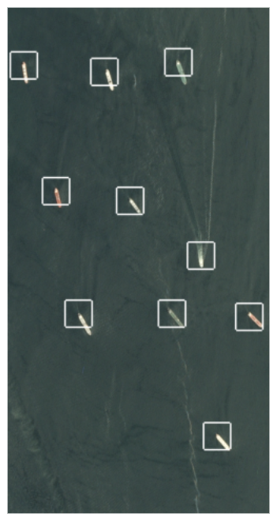
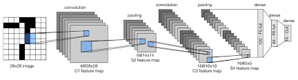

# Boat Detection with a CNN

A small convolutional network that finds boats in satellite images of the San Francisco Bay.



## What it does

The network is a simplified LeNet-5 written in PyTorch. It looks at 80x80 pixel image chips and says "ship" or "no ship". To search a larger satellite scene, a sliding window moves over the image and draws a box wherever the model is confident there is a ship.

## Results

| Metric | Value |
|---|---|
| Test accuracy | 0.90 |
| Test images | 500 |
| Training images | 2,000 |

Numbers are from the notebook output. The split is random with no fixed seed, so a re-run will give a slightly different result.

## How it works

1. Load `shipsnet.json` (2,800 labeled 80x80 RGB chips). The first 2,500 are used.
2. Scale pixels to 0–1 and split 80/20 into train and test.
3. Train the CNN for 50 epochs (SGD, learning rate 0.001, momentum 0.9, batch size 30).
4. Measure accuracy on the test set.
5. Slide an 80x80 window over a full scene with step 10. Mark a ship where the ship score is above 0.9, skipping windows that overlap a ship already found.

Network layout:



```
Conv(3->6, 5x5) -> ReLU -> MaxPool -> Dropout
Conv(6->16, 5x5) -> ReLU -> MaxPool -> Dropout
Linear(4624->120) -> Linear(120->84) -> Linear(84->2) -> Softmax
```

## Quick start

1. Download `shipsnet.json` from the Kaggle dataset "Ships in Satellite Imagery" (Planet data, CC BY-SA 4.0) and put it in `dataset/shipsnet.json`.
2. Install the packages and open the notebook:

```bash
pip install torch torchvision numpy matplotlib scikit-learn tqdm jupyter
jupyter notebook "Bote_detection_using_images_code (1).ipynb"
```

## Project structure

```
Bote_detection_using_images_code (1).ipynb   Data loading, training, evaluation, scene search
LeNet-5.png                                  Diagram of the LeNet-5 architecture
sf_1.png                                     Example scene with detected boats
```

## Notes and limitations

- This was a university learning project from 2022.
- The dataset is not included in the repo.
- The scene-search cell reads `/scene/sf_1.png`. The `sf_1.png` in this repo is the finished result with boxes already drawn, not the raw scene.
- `plt.style.use('seaborn')` fails on matplotlib 3.6 and newer. Use `'seaborn-v0_8'` there.
- The model uses Softmax with MSE loss. Cross-entropy would be the usual choice.
- The notebook's closing text mentions 95% accuracy, but the recorded output is 0.90.
